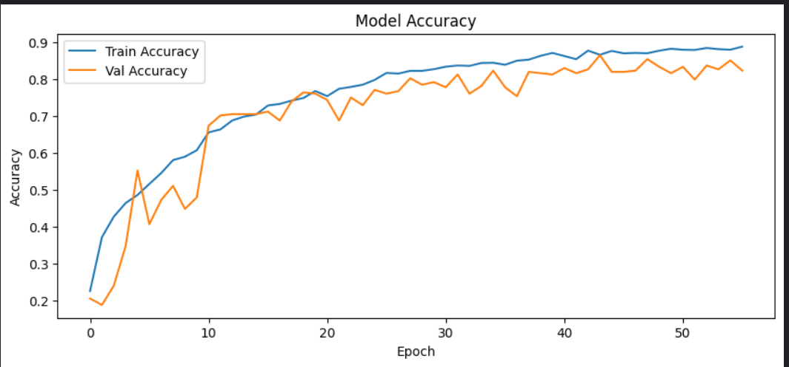

# Emotion Recognition from Speech

Speech Emotion Recognition (SER) system built on the **RAVDESS Emotional Speech Audio** dataset for the CodeAlpha Machine Learning internship task.

## Project Overview

This project predicts human emotions from speech audio using a deep learning pipeline.  
The workflow includes:

- audio loading and preprocessing
- MFCC, delta, and delta-delta feature extraction
- data augmentation
- CNN-based classification
- focal loss and class balancing
- evaluation using accuracy, precision, recall, F1-score, and confusion matrix

## Dataset

The project uses the **RAVDESS Emotional Speech Audio** dataset.

### Dataset highlights
- **24 actors**
- **1440 speech audio files**
- **8 emotion classes**

### Emotion labels
- angry
- calm
- disgust
- fearful
- happy
- neutral
- sad
- surprised

### File naming convention

RAVDESS files follow a structured filename format such as:

```text
03-01-05-01-02-01-12.wav
```

The third field indicates the emotion code:

| Code | Emotion |
|------|---------|
| 01 | neutral |
| 02 | calm |
| 03 | happy |
| 04 | sad |
| 05 | angry |
| 06 | fearful |
| 07 | disgust |
| 08 | surprised |

## Methodology

### 1) Audio preprocessing
Each audio file is loaded with Librosa, using a fixed duration and offset so that all clips are processed consistently.

### 2) Feature extraction
For each audio sample, the model extracts:

- **MFCC** (Mel-Frequency Cepstral Coefficients)
- **Delta MFCC** (first-order temporal derivative)
- **Delta-Delta MFCC** (second-order temporal derivative)

If the MFCC matrix is represented as:

\[
X \in \mathbb{R}^{40 \times T}
\]

then the final feature tensor becomes:

\[
\mathbf{F} = \text{stack}(X, \Delta X, \Delta^2 X) \in \mathbb{R}^{40 \times 173 \times 3}
\]

where:
- \(40\) = number of MFCC coefficients
- \(173\) = fixed time dimension after padding/truncation
- \(3\) = channels for MFCC, delta, and delta-delta

### 3) Normalization
Features are standardized using the training statistics:

\[
F' = \frac{F - \mu}{\sigma + \epsilon}
\]

where:
- \(\mu\) = training mean
- \(\sigma\) = training standard deviation
- \(\epsilon\) prevents division by zero

### 4) Data augmentation
To improve generalization, the training set is expanded with audio augmentation such as:
- additive noise
- time shift
- pitch shift
- time stretching

### 5) Model architecture
A convolutional neural network is used to learn emotion patterns from the feature maps.

### 6) Loss function
The model uses **categorical focal loss** with label smoothing.

For class probability \(p_t\), focal loss is:

\[
\mathcal{L}_{\text{focal}} = - \alpha (1 - p_t)^\gamma \log(p_t)
\]

where:
- \(\alpha\) balances class importance
- \(\gamma\) focuses learning on hard examples

This helps the model pay more attention to difficult samples and minority-class errors.

## Pipeline

1. Load dataset paths and labels  
2. Encode emotion classes  
3. Split data into train, validation, and test sets  
4. Extract MFCC + delta + delta-delta features  
5. Apply augmentation on training data  
6. Normalize using training statistics  
7. Train a CNN model with focal loss  
8. Evaluate using classification metrics  
9. Save model, label map, and normalization stats  
10. Run single-file emotion prediction

## Model Summary

The final model is a CNN-based classifier with:
- convolution blocks
- batch normalization
- max pooling
- dropout
- global average pooling
- dense classification head

## Results

### Final test metrics
- **Accuracy:** 0.8576
- **Precision:** 0.8664
- **Recall:** 0.8539
- **F1-score:** 0.8486

### Per-class performance snapshot
| Emotion | Precision | Recall | F1-score |
|---------|-----------|--------|----------|
| angry | 0.9722 | 0.9211 | 0.9459 |
| calm | 0.6667 | 1.0000 | 0.8000 |
| disgust | 0.9697 | 0.8421 | 0.9014 |
| fearful | 0.8444 | 0.9744 | 0.9048 |
| happy | 0.9211 | 0.8974 | 0.9091 |
| neutral | 0.6818 | 0.7895 | 0.7317 |
| sad | 0.8750 | 0.5385 | 0.6667 |
| surprised | 1.0000 | 0.8684 | 0.9296 |

## Visual Results

### Accuracy Curve


### Loss Curve


### Confusion Matrix


### Normalized Confusion Matrix


### Classification Report Snapshot


## Interpretation

The confusion matrix shows strong recognition for:
- angry
- fearful
- disgust
- surprised

The most challenging classes are:
- calm
- neutral
- sad

This is expected because these emotions have overlapping acoustic characteristics in speech.

## Files Included

```text
├── emotion_recognition_best.keras
├── label_classes.json
├── train_mean.npy
├── train_std.npy
├── notebook.ipynb
├── README.md
└── images/
    ├── accuracy_curve.png
    ├── loss_curve.png
    ├── confusion_matrix.png
    ├── normalized_confusion_matrix.png
    └── classification_report.png
```

## Technologies Used

- Python
- TensorFlow / Keras
- Librosa
- NumPy
- Pandas
- Scikit-learn
- Matplotlib
- Seaborn

## How to Run

1. Clone the repository
2. Install dependencies
3. Open the notebook
4. Run all cells
5. Test the trained model on a `.wav` file

## Dependencies

```bash
pip install tensorflow librosa numpy pandas matplotlib seaborn scikit-learn
```

## Future Improvements

Possible next steps:
- CRNN (CNN + LSTM) architecture
- transfer learning on audio embeddings
- larger and more diverse speech datasets
- real-time streamlit or flask demo
- speaker-independent evaluation

## Author

**Md Raiyan Bhuiyan**

## Acknowledgment

This project was completed as part of the CodeAlpha machine learning internship task using the RAVDESS emotional speech dataset.
