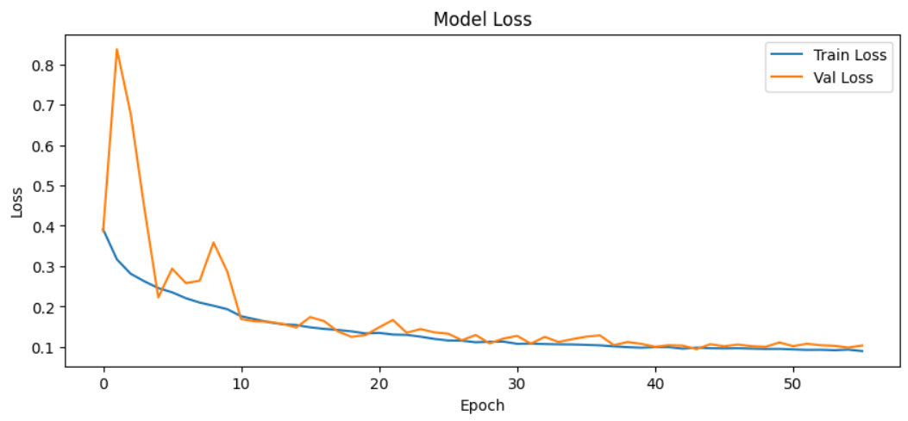
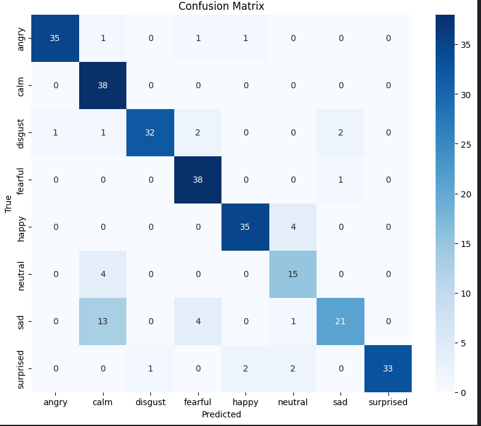
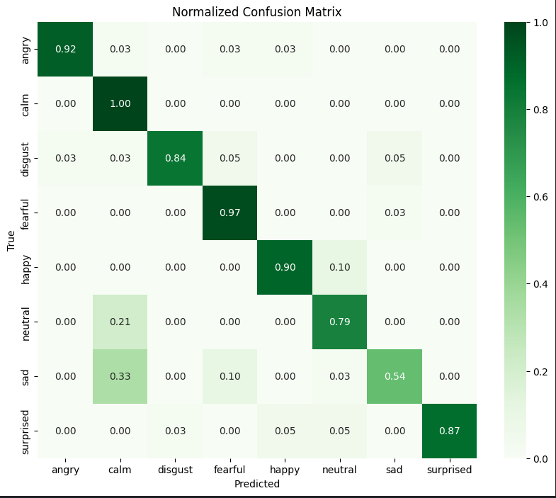

# Emotion Recognition from Speech

Speech Emotion Recognition (SER) system built on the **RAVDESS Emotional Speech Audio** dataset for the CodeAlpha Machine Learning internship task.

---

# Project Overview

This project predicts human emotions from speech audio using a deep learning pipeline.

The workflow includes:

- Audio loading and preprocessing
- MFCC, Delta, and Delta-Delta feature extraction
- Data augmentation
- CNN-based classification
- Focal loss and class balancing
- Evaluation using Accuracy, Precision, Recall, F1-score, and Confusion Matrix

---

# Dataset

The project uses the **RAVDESS Emotional Speech Audio** dataset.

## Dataset Highlights

- **24 Actors**
- **1440 Speech Audio Files**
- **8 Emotion Classes**

## Emotion Labels

- angry
- calm
- disgust
- fearful
- happy
- neutral
- sad
- surprised

## File Naming Convention

RAVDESS files follow a structured filename format:

```text
03-01-05-01-02-01-12.wav
```

The third field represents the emotion label.

| Code | Emotion |
|------|----------|
| 01 | neutral |
| 02 | calm |
| 03 | happy |
| 04 | sad |
| 05 | angry |
| 06 | fearful |
| 07 | disgust |
| 08 | surprised |

---

# Methodology

## 1) Audio Preprocessing

Each audio file is loaded using Librosa with:
- fixed duration
- fixed offset
- consistent sampling

This ensures all speech samples are processed uniformly.

---

## 2) Feature Extraction

The model extracts:

- MFCC (Mel-Frequency Cepstral Coefficients)
- Delta MFCC
- Delta-Delta MFCC

If the MFCC matrix is represented as:

```math
X \in \mathbb{R}^{40 \times T}
```

then the final feature tensor becomes:

```math
\mathbf{F} = \text{stack}(X,\Delta X,\Delta^2 X) \in \mathbb{R}^{40 \times 173 \times 3}
```

Where:

- **40** = number of MFCC coefficients
- **173** = fixed time dimension after padding/truncation
- **3** = channels for MFCC, Delta, and Delta-Delta

---

## 3) Normalization

Features are standardized using training statistics:

```math
F' = \frac{F - \mu}{\sigma + \epsilon}
```

Where:

- **μ** = training mean
- **σ** = training standard deviation
- **ε** = prevents division by zero

---

## 4) Data Augmentation

To improve model generalization, augmentation techniques are applied:

- Additive noise
- Time shifting
- Pitch shifting
- Time stretching

This helps the model learn more robust emotional speech patterns.

---

## 5) Model Architecture

A CNN-based architecture is used for emotion classification.

The model contains:

- Convolution layers
- Batch normalization
- Max pooling
- Dropout regularization
- Global average pooling
- Dense classification layers

CNNs are highly effective for learning local time-frequency patterns from spectrogram-like audio representations.

---

## 6) Loss Function

The model uses **Categorical Focal Loss** with label smoothing.

For class probability \( p_t \), focal loss is:

```math
\mathcal{L}_{\text{focal}} = -\alpha (1-p_t)^\gamma \log(p_t)
```

Where:

- **α** balances class importance
- **γ** focuses learning on hard examples

This allows the model to focus more on difficult and minority-class samples.

---

# Pipeline

1. Load dataset paths and labels  
2. Encode emotion classes  
3. Split data into train, validation, and test sets  
4. Extract MFCC + Delta + Delta-Delta features  
5. Apply data augmentation  
6. Normalize features using training statistics  
7. Train CNN model with focal loss  
8. Evaluate model performance  
9. Save trained model and label mappings  
10. Run single-file emotion prediction  

---

# Model Summary

The final model is a CNN-based classifier optimized for speech emotion recognition.

Key components:

- CNN feature extractor
- Batch normalization
- Dropout regularization
- Global average pooling
- Dense classification head

---

# Results

## Final Test Metrics

| Metric | Score |
|--------|--------|
| Accuracy | 0.8576 |
| Precision | 0.8664 |
| Recall | 0.8539 |
| F1-score | 0.8486 |

---

## Per-Class Performance

| Emotion | Precision | Recall | F1-score |
|---------|-----------|--------|----------|
| angry | 0.9722 | 0.9211 | 0.9459 |
| calm | 0.6667 | 1.0000 | 0.8000 |
| disgust | 0.9697 | 0.8421 | 0.9014 |
| fearful | 0.8444 | 0.9744 | 0.9048 |
| happy | 0.9211 | 0.8974 | 0.9091 |
| neutral | 0.6818 | 0.7895 | 0.7317 |
| sad | 0.8750 | 0.5385 | 0.6667 |
| surprised | 1.0000 | 0.8684 | 0.9296 |

---

# Visual Results

## Accuracy Curve


---

## Loss Curve



---

## Confusion Matrix



---

## Normalized Confusion Matrix



---

## Classification Report


---

# Interpretation

The model performs strongly on:

- angry
- fearful
- disgust
- surprised

More challenging emotions include:

- calm
- neutral
- sad

This is expected because these emotions share similar acoustic properties in human speech.

---

# Project Structure

```text
CodeAlpha_Emotion-Recognition-from-Speech/
│
├── notebook.ipynb
├── README.md
├── emotion_recognition_best.keras
├── label_classes.json
├── train_mean.npy
├── train_std.npy
│
└── images/
    ├── accuracy_curve.png
    ├── loss_curve.png
    ├── confusion_matrix.png
    ├── normalized_confusion_matrix.png
    └── classification_report.png
```

---

# Technologies Used

- Python
- TensorFlow / Keras
- Librosa
- NumPy
- Pandas
- Scikit-learn
- Matplotlib
- Seaborn

---

# How to Run

## Clone Repository

```bash
git clone https://github.com/RAIYANBHUIYAN/CodeAlpha_Emotion-Recognition-from-Speech.git
```

## Install Dependencies

```bash
pip install tensorflow librosa numpy pandas matplotlib seaborn scikit-learn
```

## Run Notebook

Open:

```text
notebook.ipynb
```

Run all cells sequentially.

---

# Future Improvements

Possible future improvements:

- CRNN (CNN + LSTM)
- Transformer-based audio models
- Real-time emotion recognition
- Streamlit deployment
- Larger multilingual datasets
- Speaker-independent testing

---

# Author

**Md Raiyan Bhuiyan**

---

# Acknowledgment

This project was completed as part of the CodeAlpha Machine Learning Internship using the RAVDESS Emotional Speech Audio dataset.
